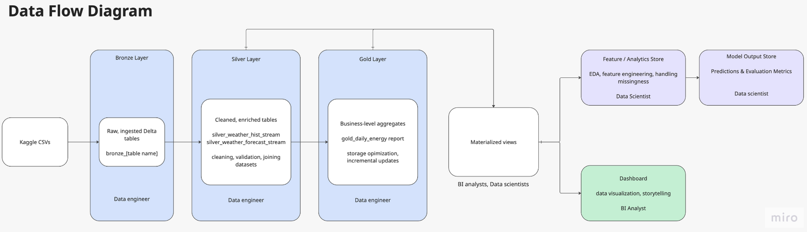

# CSCI E-103 Final Project – Energy Prosumers Lakehouse  
### Group 1 – Fall 2025

---

## 📘 Project Overview

Our team was tasked with acting as consultants for a SaaS company aiming to build a **scalable data lakehouse** and a **machine learning prediction pipeline**.  
The use case is based on **Estonian energy prosumers** (customers who both consume and produce energy, often via solar panels).  

Our objectives were to:

1. **Ingest** raw Kaggle datasets into a governed Lakehouse  
2. **Apply multi-layer transformations** using the Medallion Architecture (Bronze → Silver → Gold)  
3. Build a **machine learning model** to help predict **electricity production and consumption**  
4. Deliver a **business intelligence dashboard** powered by curated Gold tables  
5. Provide architectural, modeling, and data governance documentation  

---

## 👥 Team Members & Roles

| Name      | Role(s) |
|-----------|---------|
| **Luke** | Data Engineer 1 |
| **Kenichi** | Data Engineer 2 |
| **Selin** | Data Scientist 1 |
| **Liwei** | Data Scientist 2 & BI Analyst 2 |
| **Peiran** | BI Analyst 1 |
| **Abby** | Data Architect 1 & Group Leader |
| **Chijioke** | Data Architect 2 |

---

# 🏗️ Architecture Summary

We implemented a **Lakehouse** using Delta Lake with three layers:

### **BRONZE** – Raw Delta tables created from CSVs  
### **SILVER** – Cleaned, enriched, and (for weather data) **streamed**  
### **GOLD** – Aggregated, business-ready tables for BI and ML  

Streaming was implemented for the Silver layer using Structured Streaming + `trigger(once=True)`.

---

# 📊 End-to-End Data Lineage Diagram  
*(Developed by Kenichi – Data Engineer 2)*

This diagram shows how raw data flows from ingestion to BI outputs.

```text
                             ┌──────────────────────────────┐
                             │     Raw CSV Files (Kaggle)    │
                             │  client.csv                   │
                             │  train.csv                    │
                             │  gas_prices.csv               │
                             │  electricity_prices.csv       │
                             │  historical_weather.csv        │
                             │  forecast_weather.csv          │
                             │  weather_station_mapping.csv   │
                             └───────────────┬────────────────┘
                                             |
                                             v
                          ┌────────────────────────────────────────┐
                          │              BRONZE LAYER              │
                          │     (Raw, Ingested Delta Tables)       │
                          │-----------------------------------------│
                          │ bronze_client                          │
                          │ bronze_train                           │
                          │ bronze_gas_prices                      │
                          │ bronze_electricity_prices              │
                          │ bronze_weather_hist                    │
                          │ bronze_weather_forecast                │
                          │ bronze_weather_mapping                 │
                          └───────────────┬────────────────────────┘
                                          |
                                          v
                ┌──────────────────────────────────────────────────────────┐
                │                      SILVER LAYER                        │
                │       (Cleaned, Enriched, **STREAMING** Version)        │
                │----------------------------------------------------------│
                │ Streaming read from:                                     │
                │   - bronze_weather_hist                                  │
                │   - bronze_weather_forecast                              │
                │ Join with static mapping table:                          │
                │   - bronze_weather_mapping (adds county)                 │
                │ Structured Streaming w/ trigger=once →                   │
                │   - silver_weather_hist_stream                           │
                │   - silver_weather_forecast_stream                       │
                │ Checkpoints stored in UC Volume                          │
                └───────────────┬──────────────────────────────────────────┘
                                |
                                v
        ┌─────────────────────────────────────────────────────────────────────────┐
        │                                GOLD LAYER                               │
        │     (Business-level aggregates, upserts, optimized for BI queries)      │
        │-------------------------------------------------------------------------│
        │ gold_daily_energy_report                                                │
        │ - Combines county weather, pricing, and consumption                     │
        │ - Uses Delta MERGE for incremental updates                              │
        │ - OPTIMIZE + ZORDER BY (county, date)                                   │
        └───────────────────┬──────────────────────────────────────────────────────┘
                            |
                            v
                   ┌──────────────────────────────────┐
                   │   BI Dashboards + ML Workloads    │
                   │  (Consuming curated Gold tables)  │
                   └──────────────────────────────────┘
```

---

# 🧑‍💼 Team Contributions

This section describes the contributions of each role in our group, aligned to the project requirements of CSCI E-103.

---

## 🛠️ Data Engineering

### **Data Engineer 1 – Luke**

Luke developed the foundational components of our Lakehouse pipeline:

#### ✔ Repository & Project Framework
- Created the GitHub repository and initial notebook structure  
- Established folder organization used throughout the project  

#### ✔ Bronze Layer Ingestion
Converted raw Kaggle CSVs into Delta tables, including:

- `bronze_client`  
- `bronze_train`  
- `bronze_gas_prices`  
- `bronze_electricity_prices`  
- `bronze_weather_hist`  
- `bronze_weather_forecast`  
- `bronze_weather_mapping`  

#### ✔ Batch Silver Layer  
- Joined weather data with county mapping  
- Produced initial Silver weather tables used by downstream consumers  

#### ✔ Gold Aggregation Layer (Batch)
Implemented the first Gold-level business table:

- Built `gold_daily_energy_report`  
- Performed daily aggregations  
- Added Delta **MERGE** logic for incremental updates  

**Luke’s work created the initial medallion pipeline upon which the rest of the system was built.**

---

### **Data Engineer 2 – Kenichi**

Kenichi completed the remaining Data Engineering requirements and significantly enhanced reliability and performance.

#### 🔹 1. Implemented Silver Structured Streaming Layer (`trigger=once`)
- Converted the Silver weather processing pipeline into a **Structured Streaming** job  
- Streaming inputs:  
  - `bronze_weather_hist`  
  - `bronze_weather_forecast`
- Joined with dimension table:  
  - `bronze_weather_mapping` (adds county)
- Outputs:
  - `silver_weather_hist_stream`  
  - `silver_weather_forecast_stream`
- Implemented checkpointing in UC Volume  
- Fully satisfies the DE rubric requirement for *incremental processing via streaming*  

#### 🔹 2. Added Configuration + Data Quality Checks  
Strengthened pipeline quality by adding:

- Centralized catalog/schema/volume configuration  
- Table existence checks before streaming  
- Required column validation (lat/long/datetime)  
- Clear error surfacing to prevent silent failures  

#### 🔹 3. Optimized Gold Layer Performance  
Added BI-focused optimization:

```sql
OPTIMIZE gold_daily_energy_report
ZORDER BY (county, date);
```
#### 🔹 4. Created the End-to-End Data Lineage Diagram
- Authored a clear, intuitive lineage diagram (notebook: `00_data_lineage_diagram`)  
- Illustrates how data moves through the Medallion Architecture  
- Highlights where Structured Streaming occurs  
- Used as a visual anchor during the final presentation  

#### 🔹 5. Added Data Engineering Helper Utilities
Developed reusable helper functions used by Data Engineering, Data Science, and BI:

- `table_info(table)` – Row count, column count, schema  
- `compare_schemas(table1, table2)` – Highlights differences between tables  
- `preview(table)` – Displays first rows and schema  
- `validate_columns(table, expected_cols)` – Checks for required columns  

These utilities speed up debugging, validation, and schema exploration across the team.

#### 🔹 6. Pipeline Hardening & Documentation
- Added markdown explanations to notebooks  
- Ensured naming and configuration conventions were consistent  
- Improved maintainability and clarity of the DE pipeline  

---

## 🤖 Data Science  

### **Data Scientist 1 – Selin**
Run 06_DataScience.ipynb

#### 🔹 1. Exploratory Data Analysis (EDA)  
- Performed exploratory data analysis on the gold dataset (skewness,distribution, missing values, duplicated rows, outliers, correlation matrix, visualisations between different variables.
- Log transformation of heavily skewed variables

#### 🔹 2. Feature engineering 
- Two sets of variables for two models (basic and complex).
- split the date column into day, month and year to make data more meaningful
- converted the county column to category from integer
- In addition to basic data, aggregated data from Liwei (county and date) to include more complex variables such as avg_radiation_l, 
Has_business, n_product_types,total_energy_production.
 
#### 🔹 3. Model training with XGBoost
- splitting data into training and test
- training and tetsing with XGBoost

#### 🔹 4. Model Evaluation and experiment tracking
- Model maintenance with MLflow.
- Plot Actual vs Prediction values
- RMSE, R2, MAE, MAPE
- Residual plot
- Error distribution 
- Feature importance values from the model

---

### **MLOps - Liwei**

#### 🔹 ML Data pipeline
* 01A_bronze_enhancer.sql: stream table of data sources of client, weather, pricing, and train data.
* 02A_silver_enhancer.sql: produce cleansed, enriched data with GIS transformation for ML 
* 03A_gold_enhancer.sql: construct weather, client attribute, pricing and energy production and consumption data aggregated features.  

### **Data Scientist 2 - Liwei**

#### 🔹 ML Model pipelinea 
- 06a_prosumer_feature_selection.ipynb
  - Focused on exploring and  selecting features at County level base on Selin's finding.

- 7_prosumer_model_training.ipynb
  - Loop through all county (free version can be limiting)
  - Model training with Linear Regression managed by Spark ML Pipeline, 
  - Crossvalidation using RMSE.

- 8_prosumer_model_application.ipynb
  - Simulate the model application by Streaming test data repartition to 500
  - Load the Model directory
  - Using the model base on its Geo location (county) and output the prediction table and prediction summary stream tables.
   
---

## 📊 Business Intelligence  
### **BI Analyst 1 - Peiran**
- Created sql queries to pull data from gold layer and processed with additional information for dashboard
- created the business insights to demonstate:
  1. key drivers of energy demand and supply
  2. energy imbalances and actionable root causes
  3. Geographic focus for targeted optimization

The dashboard has 3 tabs:
- tab Overview: electricity production and consumption by key determinats
  this tab shows
  1. the total electricity consumption by counties and their percentages;
  2. total electricity over time and how it compares with the average temperature over time.
  3. total electricity production by counties and percentages
  4. total electricity production over time and how it compares with the average radiation over time
  5. energy imbalance over time (total consumption - total production)
  6. by what solar product and residential type that has the most imbalance
  7. electricity imbalance by counties
- tab Production and Consumption details
  1. total production and consumption by month
  2. seasonal prosumption pattern
  3. daily prosumption pattern
  4. prosumption by residential type
  5. prosumption by counties
  6. prosumer behaviors
- tab weather condition analysis
  1. temperature vs radiation (median, mean)
  2. temperature vs radiation by counties
 
Dashboard data refresh: data updates are automatic. Everything refreshes every day at 12:30 AM, so users are always working with current data without needing to do anything manually.

Data governance: We’ve set up role-based access so off-shore county users only see data for County 1 and 10, while mainland users can see the rest. This keeps the data secure and relevant for each group.
   is_member('Off_shore_county') 
      AND county IN (1, 10)          -- offshore counties
   is_member('Mainland_county')
      AND county NOT IN (1, 10)      -- all other counties


### **BI Analyst 2 - Liwei**
- Prosumer model application dashboard with sample county
  - Target
  - Prediction

Expected BI deliverables:

- SQL queries powering dashboards  
- Visualizations of daily usage, pricing, and production trends  
- Materialized views or refresh schedules  
- BI security model (California vs non-California access rules)  
- Dashboard layout and business insights  

---

## 🏛️ Data Architecture  

### **Data Architect 1 - Abby**

**ERD with PK/FK relationships**


**DFD**


**Table cardinality & scale explanations:**
See the 'data dictionary.csv' file for explanations

**Partitioning & indexing strategy**
- Progressive optimization: Partitioning and indexing are applied incrementally, with more deliberate optimization introduced at the Silver layer
- Time-based partitioning: Tables are partitioned by event or forecast date, supporting efficient time-range queries for weather and pricing data
- Location-based option: Geographic fields (e.g., region or county) can also be used as a partitioning dimension when spatial filtering is common.

**CI/CD & deployment considerations**
- Terraform is used to deploy pipeline infrastructure, ensuring consistency, repeatability, and auditability across environments
- Automated deployment: CI/CD pipelines (Databricks Asset Bundles with GitHub Actions) manage deployments of workflows, models, and configurations
- Batch and streaming support: The same platform supports current-state batch pipelines and future-state streaming pipelines without re-architecture
- Scalable design: This approach enables the system to scale and adapt as business requirements evolve.

**Disaster recovery planning**
- Version-controlled infrastructure and pipelines: All code and configurations are stored in version control, enabling consistent environment recreation and rapid recovery
- Durable, replayable data storage: Delta Lake supports reprocessing historical data and recovering streaming pipelines after failures
- Regional replication: Critical datasets are replicated across regions (primary: US East 1; backup: US East 2) to ensure availability during outages.
- Streaming resilience: Real-time jobs use checkpointing to restart from the last known good state, minimizing downtime and data loss

**What if business came back with streaming requirement**
- Event bus backbone: A central event bus (e.g., Kafka) continuously ingests smart-meter readings, weather updates, and market prices, making data available immediately rather than with hourly or daily latency
- Stream processing layer: Spark Structured Streaming processes events as they arrive, aligns data by time, joins multiple sources, computes rolling features, and handles late-arriving prosumer data common in distributed energy systems
- Low-latency model serving: Updated features feed directly into near real-time model serving (Databricks Model Serving or MLflow), enabling continuously refreshed consumption and production forecasts
- Operational delivery: Forecasts are pushed to grid operations and alerting dashboards to support faster responses to imbalance and risk conditions
- Historical persistence: All events and predictions are stored in Delta Lake, supporting model retraining, long-term trend analysis, and auditability for continuous improvemeny

### **Data Architect 2 - Chijioke**


This section documents the architectural design decisions that support scalability, governance, and analytics readiness across the Lakehouse.

Extended enterprise architecture diagrams
                             ┌───────────────────────────────┐
                             │        DIM: client            │
                             │  (bronze_client / silver)     │
                             │-------------------------------│
                             │ PK: client_id (logical)       │
                             │ attrs: segment, region, ...   │
                             └───────────────┬───────────────┘
                                             │ (optional join by client_id)
                                             │
                                             v
┌──────────────────────────────────────────────────────────────────────────────┐
│                   FACT: energy_targets (train)                               │
│                (bronze_train / silver_train)                                 │
│------------------------------------------------------------------------------│
│ Grain: 1 row per (datetime, county, is_consumption, is_business, product_type│
│        [and other categorical flags])                                         │
│------------------------------------------------------------------------------│
│ PK (logical): (datetime, county, is_consumption, is_business, product_type)  │
│ Measures: target (kWh), etc.                                                 │
│ Time keys: datetime (timestamp), date (derived)                               │
└───────────────────────────────┬──────────────────────────────────────────────┘
                                │ (temporal alignment by date/datetime)
                                │
                                v
┌──────────────────────────────────────────────────────────────────────────────┐
│                 FACT: electricity_prices (time-series)                        │
│                 (bronze_electricity_prices / silver optional)                 │
│------------------------------------------------------------------------------│
│ Grain: 1 row per datetime (or date)                                           │
│ Key (logical): datetime/date                                                  │
│ Measures: price                                                              │
└──────────────────────────────────────────────────────────────────────────────┘


┌──────────────────────────────────────────────────────────────────────────────┐
│                   FACT: gas_prices (time-series)                              │
│                   (bronze_gas_prices / silver optional)                       │
│------------------------------------------------------------------------------│
│ Grain: 1 row per datetime (or date)                                           │
│ Key (logical): datetime/date                                                  │
│ Measures: price                                                              │
└──────────────────────────────────────────────────────────────────────────────┘


                             ┌──────────────────────────────────┐
                             │  DIM: weather_station_map         │
                             │ (bronze_weather_station_map)      │
                             │----------------------------------│
                             │ Key (logical): (latitude,longitude)│
                             │ attrs: county_name (and/or county) │
                             └───────────────┬──────────────────┘
                                             │ (geo enrichment join)
                                             │ lat/lon join in Silver
                                             v
┌──────────────────────────────────────────────────────────────────────────────┐
│                  FACT: weather_hist (observed)                                │
│      (bronze_historical_weather → silver_weather_hist)                        │
│------------------------------------------------------------------------------│
│ Grain: 1 row per (latitude, longitude, datetime)                              │
│ PK (logical): (latitude, longitude, datetime)                                 │
│ Measures: temperature, dewpoint, rain, snowfall, windspeed, cloudcover, ...   │
│ Enriched attrs (Silver): county_name (from station_map)                       │
└──────────────────────────────────────────────────────────────────────────────┘


┌──────────────────────────────────────────────────────────────────────────────┐
│                  FACT: weather_forecast (predicted)                           │
│      (bronze_forecast_weather → silver_weather_forecast)                      │
│------------------------------------------------------------------------------│
│ Grain: 1 row per (latitude, longitude, forecast_datetime, hours_ahead)        │
│ PK (logical): (latitude, longitude, forecast_datetime, hours_ahead)           │
│ Measures: temperature, dewpoint, precipitation, radiation, wind components... │
│ Enriched attrs (Silver): county_name (from station_map)                       │
└──────────────────────────────────────────────────────────────────────────────┘


                                  ┌──────────────────────────────────────────┐
                                  │               GOLD LAYER                 │
                                  │------------------------------------------│
                                  │ gold_daily_energy_report (or equivalents)│
                                  │ Grain: 1 row per (county/date)           │
                                  │ Inputs: silver_train + silver_weather_*  │
                                  │         + prices (optional)              │
                                  └──────────────────────────────────────────┘


🔹 1. Logical Data Model & ERD Design

The Lakehouse is centered around time-series fact tables enriched by geographic and client dimensions.

Fact tables

Energy consumption & production (train)

Historical and forecast weather (hourly granularity)

Electricity and gas pricing

Dimension tables

Client metadata

Weather station → county mapping

Relationships are applied logically in the Silver layer through joins rather than enforced foreign-key constraints, aligning with Delta Lake and Lakehouse best practices.

🔹 2. Table Cardinality & Data Scale Validation

Architectural decisions were validated against real data volumes:

High-cardinality tables

bronze_train / silver_train: ~2M+ records

bronze_historical_weather / silver_weather_hist: ~1.7M+ records

Medium-cardinality tables

Electricity and gas prices (time-series)

Low-cardinality tables

Client and county mapping dimensions

This informed partitioning, deduplication, and aggregation strategies used downstream.

🔹 3. Partitioning & Optimization Strategy

Bronze Layer

Minimal transformation

No aggressive partitioning to preserve raw data fidelity

Silver Layer

Date-derived columns added for time-based processing

Deduplication enforced on natural keys (location + timestamp)

Streaming Silver tables leverage checkpointing for incremental ingestion

Gold Layer

Business-level aggregates optimized for BI

OPTIMIZE and ZORDER BY (county, date) applied for query performance

🔹 4. Deployment & Pipeline Reusability

The architecture supports re-runnable and production-aligned workflows:

Fully qualified catalog and schema references

Idempotent table creation using managed Delta tables

Layered notebook structure (Bronze → Silver → Gold)

Clear separation of batch and streaming responsibilities

This design is compatible with future Databricks Jobs or CI/CD automation.

🔹 5. Data Reliability & Recovery

Delta Lake provides ACID guarantees, schema enforcement, and versioning

Bronze tables serve as immutable recovery sources

Silver and Gold layers are fully reproducible from Bronze

Streaming checkpoints ensure exactly-once processing semantics

🔹 6. Enterprise Architecture Alignment

The Lakehouse supports:

Batch ingestion of raw source data

Incremental processing via Structured Streaming

Curated Gold tables for BI dashboards and ML workloads

Governed schemas for lineage, discoverability, and reuse

This positions the platform as a scalable analytics foundation beyond the course use case.

🔹 Data Architect Contributions (Chijioke John Ifedili)

Validated Bronze-layer schema integrity and temporal coverage

Ensured Silver-layer join compatibility and enrichment readiness

Reviewed table scale, partitioning, and optimization strategies

Aligned Lakehouse design with enterprise data architecture principles

This work ensured the system was governed, scalable, and analytics-ready.

---
## 📁 Repository Structure

```text
final-project/
│
├── 00_data_lineage_diagram/          ← Lineage diagram notebook (Kenichi)
├── 00_helper_utilities/              ← Helper DE utilities (Kenichi)
│
├── 01_ingest_bronze/                 ← Bronze ingestion (Luke)
├── 02_processing_silver/             ← Silver batch (Luke)
├── 02A_processing_silver_streaming/  ← Silver streaming (Kenichi)
│
├── 03_reporting_gold/                ← Gold aggregation + optimization
└── README.md
```
---

## ▶️ Running the Pipeline

1. **Run `01_ingest_bronze`** to create Bronze Delta tables  
2. **Run either:**
   - `02_processing_silver` (batch)  
   - `02A_processing_silver_streaming` (streaming – recommended)  
3. **Run `03_reporting_gold`** to generate Gold aggregates  
4. BI & ML workflows consume Gold tables as inputs  

---

## 📚 References

- Databricks Delta Lake Documentation  
- CSCI E-103 Course Lectures & Labs  
- Kaggle: Estonian Energy Prosumers Dataset  

